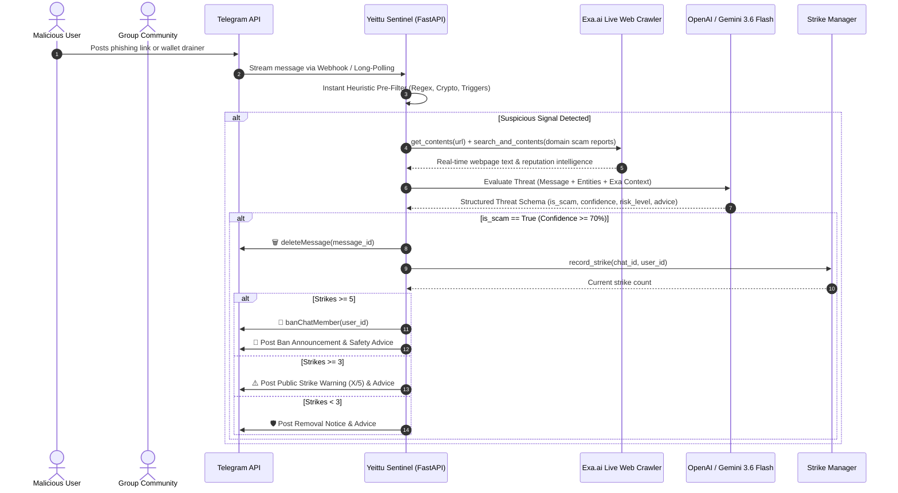

# 🛡️ Yeittu Sentinel: Autonomous Ambient Anti-Scam Agent for Telegram

> **AI Tinkerers Hackathon: Agents, Everywhere (Abuja)**  
> **Theme**: *Agents Leaving the Chatbox — Showing up where conversations and real work happen.*  
> **GitHub Repository**: [https://github.com/DamaMichaelYohanna/scam_detect](https://github.com/DamaMichaelYohanna/scam_detect)  
> **Bot Link**: [@yeittubot](https://t.me/yeittubot)

---

## 🎯 Executive Summary & Problem Statement

Crypto, Web3, and tech communities on Telegram lose hundreds of millions of dollars each year to **phishing links, wallet drainers (Permit2 approvals), typosquatted domains, and support impersonation scams**. 

Traditional bots are dumb keyword matchers that either fail on new domains or trigger endless false positives. Meanwhile, conversational AI agents are trapped inside private 1-on-1 chatboxes where victims never think to consult them before clicking a malicious link.

**Yeittu Sentinel** brings the AI agent directly into the group environment. It operates ambiently and autonomously:
1. **Listens in real time** to group message streams.
2. **Inspects live destinations** using **Exa.ai** to read webpage contents and search real-time domain scam intelligence.
3. **Performs cognitive threat evaluation** using **OpenAI (GPT-4o-mini)** and **Google Gemini (Gemini 3.6-flash)** with structured outputs.
4. **Executes progressive moderation**: Instantly deletes scam links, issues strike-based community warnings at 3 infractions, and permanently bans malicious actors upon reaching 5 strikes.

---

## 🌟 Hackathon Theme Alignment: "Agents, Everywhere"

| Chatbox Agent (Old Paradigm) | Yeittu Sentinel (Agents Everywhere) |
|---|---|
| User must manually copy/paste suspicious link into a private chat | Agent lives directly inside the Telegram group ambiently |
| Reactive: only answers when explicitly prompted | Proactive: intercepts threats before other users click |
| Operates on static knowledge cutoffs | Reads live web DOM & real-time domain reputation via Exa.ai |
| Informational only | **Agentic & Action-Oriented**: Deletes messages, tracks strikes, and bans bad actors |

---

## 🏗️ Technical Architecture & Workflow



---

## 🔧 Sponsor & Partner Integrations

### 1. Exa.ai (Live Web Retrieval & Reputation Intelligence)
- **Direct Live Page Reading (`get_contents`)**: Scrapes the live DOM text and headings of links posted in the group to verify whether the page prompts for wallet connections, seed phrases, or fraudulent claims.
- **Real-Time Threat Search (`search_and_contents`)**: Queries the web for live phishing reports, domain age flags, and community hack warnings.

### 2. OpenAI & Google Gemini (Cognitive Threat Reasoning)
- **Multi-Provider Engine**: Hot-swappable between **OpenAI (`gpt-4o-mini`)** and **Google Gemini (`gemini-3.6-flash`)** via single configuration setting.
- **Strict Structured Outputs**: Returns deterministic JSON schemas (`ScamAnalysisResult`) containing threat type, confidence score, risk level, short summary, and user-friendly safety advice.

---

## ⚖️ Progressive Disciplinary Strike Policy

To prevent abuse while minimizing false-positive disruptions, Yeittu Sentinel implements a **5-Strike Escalation Protocol**:

| Level | Infraction | Action Taken |
|---|---|---|
| **Strike 1 & 2** | Isolated Scam Attempt | 🗑️ Malicious message is deleted immediately + safety card posted |
| **Strike 3 & 4** | Repeated Offense | 🗑️ Message deleted + ⚠️ **Public Group Warning** with remaining strikes counter |
| **Strike 5** | Habitual Bad Actor / Bot | 🗑️ Message deleted + 🚫 **Permanent Ban from Group** + Ban notification |

---

## 🏆 Evaluation Criteria Alignment

### 1. Core Requirements & Functionality
- **Fully functional end-to-end working system** built from scratch during the hackathon.
- Connects live with Telegram Bot API, Exa.ai, and Gemini/OpenAI.
- Operates in real time with sub-second heuristic filtering and asynchronous AI evaluation.

### 2. Innovation & Theme Alignment
- Breaks out of the chatbox: protects hundreds of users in real time where discussions happen.
- Environment-native: uses Telegram administrative powers (message deletion, user bans, formatted HTML security alerts) to take concrete agentic actions.

### 3. Technical Execution & Architecture
- **FastAPI Backend**: Clean layered architecture (`app/services`, `app/routers`, `app/models`).
- **Dual Connection Mode**: Direct Telegram Long-Polling for local development + Webhook ingestion with secret token verification for cloud deployments.
- **Resilient Fallbacks**: Multi-LLM fallback architecture ensures 100% uptime if one provider experiences rate limits.

### 4. Usefulness & Agentic Experience
- Solves a multi-million-dollar real-world cybersecurity threat.
- Proactively educates community members with actionable safety advice (e.g. explaining typosquats and wallet signature risks).

---

## 🚀 Getting Started & Local Reproduction

### 1. Clone & Install Dependencies
```bash
git clone https://github.com/DamaMichaelYohanna/scam_detect.git
cd scam_detect
pip install -r requirements.txt
```

### 2. Configure Environment Variables
Edit `.env`:
```env
# Telegram
TELEGRAM_BOT_TOKEN=8946767047:AAGkNfp-Z5mrjFxRDS7BfHhkGgNzk6opnl0

# AI Provider ("gemini" or "openai")
AI_PROVIDER=gemini
GEMINI_API_KEY=your_gemini_api_key
GEMINI_MODEL=gemini-3.6-flash

# Exa.ai
EXA_API_KEY=your_exa_api_key

# Moderation Rules
POLLING_MODE=true
RISK_THRESHOLD=0.7
BAN_THRESHOLD=0.85
WARN_STRIKES=3
MAX_STRIKES_BAN=5
AUTO_WARN=true
AUTO_BAN=true
AUTO_DELETE_SCAM_MESSAGE=true
```

### 3. Run the Sentinel
```powershell
uvicorn app.main:app --reload
```

### 4. Run the Verification Test Suite
```powershell
python test_pipeline.py
```
